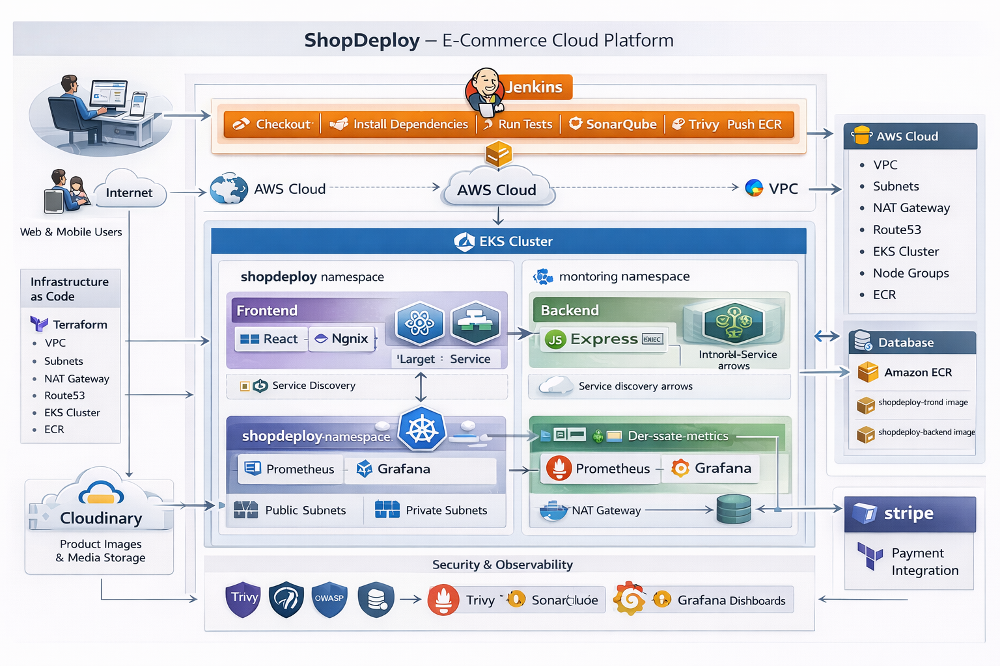

# 🛒 ShopDeploy - E-Commerce Application

<p align="center">
  
  
  
  
  
  
  
  
  
</p>

<p align="center">
  <b>A production-ready full-stack e-commerce application with complete DevOps implementation including CI/CD, Kubernetes deployment, Infrastructure as Code, and cloud-native infrastructure on AWS.</b>
</p>

---

## 📋 Table of Contents

- [Overview](#-overview)
- [Features](#-features)
- [Tech Stack](#-tech-stack)
- [Architecture](#-architecture)
- [Project Structure](#-project-structure)
- [Amazon Linux Setup (Quick Start)](#-amazon-linux-setup-quick-start)
- [Getting Started](#-getting-started)
- [Local Development](#-local-development)
- [Docker Deployment](#-docker-deployment)
- [Kubernetes Deployment](#-kubernetes-deployment)
- [Infrastructure (Terraform)](#-infrastructure-terraform)
- [CI/CD Pipeline](#-cicd-pipeline)
- [Monitoring](#-monitoring)
- [API Documentation](#-api-documentation)
- [Environment Variables](#-environment-variables)
- [Contributing](#-contributing)
- [License](#-license)

---

## 🎯 Overview

**ShopDeploy** is a modern, production-ready e-commerce platform built with the MERN stack (MongoDB, Express, React, Node.js). This project demonstrates enterprise-level development practices and includes a comprehensive DevOps implementation:

| Component | Technology | Purpose |
|-----------|------------|---------|
| 🏗️ **Infrastructure as Code** | Terraform | Automated AWS infrastructure provisioning |
| 🐳 **Containerization** | Docker | Consistent application packaging |
| ☸️ **Orchestration** | AWS EKS (Kubernetes) | Container orchestration & scaling |
| 🔄 **CI/CD Pipeline** | Jenkins | Automated build, test, and deployment |
| 📊 **Monitoring** | Prometheus & Grafana | Metrics collection and visualization |
| 📦 **Package Management** | Helm Charts | Kubernetes application packaging |
| 🔐 **Security** | JWT, HTTPS, IAM Roles | Authentication and authorization |

---

## ✨ Features

### Customer Features
- 🛍️ Browse products by categories
- 🔍 Search and filter products
- 🛒 Shopping cart management
- 💳 Secure checkout with Stripe
- 📦 Order tracking and history
- 👤 User authentication (JWT)
- 📱 Responsive design

### Admin Features
- 📊 Admin dashboard
- 📦 Product management (CRUD)
- 📋 Order management
- 👥 User management
- 📈 Sales analytics

### Technical Features
- 🔐 JWT-based authentication with refresh tokens
- 🖼️ Image upload with Cloudinary
- 💳 Payment processing with Stripe
- 📧 Email notifications
- 🔄 Real-time updates
- 📱 Mobile-responsive UI

---

## 🛠 Tech Stack

### Frontend
| Technology | Purpose |
|------------|---------|
| React 18 | UI Library |
| Vite | Build Tool |
| Redux Toolkit | State Management |
| React Router | Navigation |
| Tailwind CSS | Styling |
| Axios | HTTP Client |

### Backend
| Technology | Purpose |
|------------|---------|
| Node.js 18 | Runtime |
| Express.js | Web Framework |
| MongoDB | Database |
| Mongoose | ODM |
| JWT | Authentication |
| Stripe | Payments |
| Cloudinary | Image Storage |

### DevOps
| Technology | Purpose |
|------------|---------|
| Docker | Containerization |
| Kubernetes (EKS) | Orchestration |
| Terraform | Infrastructure as Code |
| Jenkins | CI/CD Pipeline |
| Helm | Package Management |
| Prometheus | Monitoring |
| Grafana | Visualization |
| AWS | Cloud Provider |

---

## 📁 Project Structure

> **Note:** For enterprise scale, consider separating into two repositories:
> - `shopdeploy-app` - Application code (backend, frontend, helm, ci-cd)
> - `shopdeploy-infra` - Infrastructure code (terraform, monitoring, networking)

```
ShopDeploy/
├── 📂 ci-cd/                       # 🔥 CI/CD Pipeline Definitions
│   ├── Jenkinsfile-ci              # CI Pipeline (Build, Test, Push)
│   └── Jenkinsfile-cd              # CD Pipeline (Deploy, Rollback)
│
├── 📂 shopdeploy-backend/          # Backend API (Node.js/Express)
│   ├── src/
│   │   ├── app.js                  # Express app configuration
│   │   ├── server.js               # Server entry point
│   │   ├── config/                 # Database & environment config
│   │   ├── controllers/            # Route controllers
│   │   ├── middleware/             # Auth, error handling, validation
│   │   ├── models/                 # Mongoose schemas
│   │   ├── routes/                 # API routes (including health)
│   │   ├── services/               # Business logic layer
│   │   ├── scripts/                # Database scripts
│   │   └── utils/                  # Helper functions
│   ├── scripts/
│   │   ├── build-and-push.sh       # Docker build (Linux)
│   │   └── build-and-push.ps1      # Docker build (Windows)
│   ├── Dockerfile                  # Multi-stage Docker image
│   ├── .env.example                # Environment template
│   ├── README.md                   # Backend documentation
│   └── package.json
│
├── 📂 shopdeploy-frontend/         # Frontend (React/Vite)
│   ├── src/
│   │   ├── App.jsx                 # Main React component
│   │   ├── main.jsx                # App entry point
│   │   ├── index.css               # Global styles
│   │   ├── api/                    # Axios API clients
│   │   ├── app/                    # Redux store configuration
│   │   ├── components/             # Reusable UI components
│   │   ├── features/               # Redux slices (auth, cart, product)
│   │   ├── layouts/                # Page layouts
│   │   ├── pages/                  # Page components
│   │   ├── routes/                 # Route definitions
│   │   └── utils/                  # Helper functions
│   ├── scripts/
│   │   ├── deploy-frontend.sh      # Deploy script (Linux)
│   │   └── deploy-frontend.ps1     # Deploy script (Windows)
│   ├── Dockerfile                  # Multi-stage Docker image (Nginx)
│   ├── nginx.conf                  # Nginx configuration
│   ├── vite.config.js              # Vite build configuration
│   ├── tailwind.config.js          # Tailwind CSS configuration
│   ├── .eslintrc.cjs               # ESLint configuration
│   ├── README.md                   # Frontend documentation
│   └── package.json
│
├── 📂 terraform/                   # Infrastructure as Code (AWS)
│   ├── main.tf                     # Main Terraform configuration
│   ├── variables.tf                # Input variable definitions
│   ├── outputs.tf                  # Output values
│   ├── data.tf                     # Data sources
│   ├── terraform.tfvars.example    # Example variables
│   ├── Makefile                    # Terraform shortcuts
│   ├── README.md                   # Terraform documentation
│   ├── backend-setup/              # S3 backend configuration
│   ├── environments/               # Environment-specific configs
│   └── modules/
│       ├── vpc/                    # VPC, subnets, NAT gateway
│       ├── iam/                    # IAM roles & policies
│       ├── ecr/                    # Container registry
│       └── eks/                    # EKS cluster & node groups
│
├── 📂 helm/                        # Helm Charts for Kubernetes (PRIMARY)
│   ├── backend/
│   │   ├── Chart.yaml              # Chart metadata
│   │   ├── values.yaml             # Default values
│   │   ├── values-dev.yaml         # Development overrides
│   │   ├── values-staging.yaml     # Staging overrides
│   │   ├── values-prod.yaml        # Production overrides
│   │   └── templates/              # Kubernetes templates
│   └── frontend/
│       ├── Chart.yaml
│       ├── values.yaml
│       ├── values-dev.yaml
│       ├── values-staging.yaml
│       ├── values-prod.yaml
│       └── templates/
│
├── 📂 gitops/                      # 🔥 GitOps Values (ArgoCD/Flux)
│   ├── README.md                   # GitOps documentation
│   ├── dev/
│   │   ├── backend-values.yaml     # Dev backend overrides
│   │   └── frontend-values.yaml    # Dev frontend overrides
│   ├── staging/
│   │   ├── backend-values.yaml     # Staging backend overrides
│   │   └── frontend-values.yaml    # Staging frontend overrides
│   └── prod/
│       ├── backend-values.yaml     # Prod backend overrides
│       └── frontend-values.yaml    # Prod frontend overrides
│
├── 📂 k8s-reference/               # ⚠️ Raw K8s manifests (REFERENCE ONLY)
│   ├── README.md                   # ⚠️ Do not use for deployments
│   ├── namespace.yaml              # Namespace definition
│   ├── backend-deployment.yaml     # Backend deployment spec
│   ├── backend-service.yaml        # Backend service
│   ├── frontend-deployment.yaml    # Frontend deployment spec
│   ├── ingress.yaml                # Ingress configuration
│   ├── hpa.yaml                    # Horizontal Pod Autoscaler
│   └── ...                         # Other reference manifests
│
├── 📂 policies/                    # 🔥 Production Governance
│   ├── branch-protection.md        # Branch protection rules
│   ├── release-strategy.md         # Release & versioning strategy
│   └── rollback-strategy.md        # Rollback procedures
│
├── 📂 docs/                        # Documentation
│   ├── AMAZON-LINUX-COMPLETE-SETUP-GUIDE.md
│   ├── HELM-SETUP-GUIDE.md
│   ├── JENKINS-SETUP-GUIDE.md
│   ├── MONITORING-SETUP-GUIDE.md
│   ├── DEVOPS-INTERVIEW-QUESTIONS.md
│   └── Project_Flow_Diagram.png    # Architecture diagram
│
├── 📂 monitoring/                  # Observability stack
│   ├── prometheus-values.yaml      # Prometheus Helm values
│   ├── grafana-values.yaml         # Grafana Helm values
│   ├── install-monitoring.sh       # Installation script
│   └── dashboards/
│       └── shopdeploy-dashboard.json
│
├── 📂 scripts/                     # 🔥 Organized Automation Scripts
│   ├── infra/                      # Infrastructure scripts
│   │   ├── ec2-bootstrap.sh        # Complete EC2 setup
│   │   ├── install-terraform.sh    # Terraform installation
│   │   ├── install-awscli.sh       # AWS CLI + eksctl
│   │   ├── terraform-init.sh       # Terraform init
│   │   ├── terraform-apply.sh      # Terraform apply
│   │   └── terraform-destroy.sh    # Terraform destroy
│   ├── docker/                     # Docker scripts
│   │   ├── build.sh                # Docker build
│   │   ├── push.sh                 # Docker push
│   │   ├── install-docker.sh       # Docker installation
│   │   └── cleanup.sh              # Cleanup images
│   ├── kubernetes/                 # Kubernetes scripts
│   │   ├── deploy.sh               # K8s deployment
│   │   ├── rollback.sh             # Rollback deployment
│   │   ├── smoke-test.sh           # Smoke tests
│   │   ├── helm-deploy.sh          # Helm deployment (Linux)
│   │   ├── helm-deploy.ps1         # Helm deployment (Windows)
│   │   ├── install-kubectl.sh      # kubectl installation
│   │   └── install-helm.sh         # Helm installation
│   ├── monitoring/                 # Monitoring/CI scripts
│   │   ├── install-grafana-prometheus.sh
│   │   ├── install-sonarqube.sh
│   │   ├── install-jenkins.sh
│   │   ├── install-jenkins.ps1
│   │   └── install-monitoring.ps1
│   └── test.sh                     # Run tests
│
├── 📄 docker-compose.yml           # Local development setup
├── 📄 .env.example                 # Environment template
├── 📄 .env                         # Environment variables (gitignored)
├── 📄 .gitattributes               # Git attributes
├── 📄 .gitignore                   # Git ignore rules
└── 📄 README.md                    # This file
```

---

## 🏛️ Architecture



### Infrastructure Components

| Layer | Component | Technology | Purpose |
|-------|-----------|------------|----------|
| **Frontend** | Web App | React + Vite | User interface, SPA |
| **Frontend** | Web Server | nginx-unprivileged (port 8080) | Static file serving, non-root execution |
| **Backend** | API Server | Node.js + Express | REST API, business logic |
| **Backend** | Authentication | JWT | Secure user authentication |
| **Database** | Primary DB | MongoDB | Data persistence |
| **Storage** | Images | Cloudinary | Product image storage |
| **Payments** | Gateway | Stripe | Payment processing |
| **Container** | Registry | AWS ECR | Docker image storage |
| **Orchestration** | Cluster | AWS EKS | Kubernetes management |
| **Infrastructure** | IaC | Terraform | Infrastructure provisioning |
| **CI/CD** | Pipeline | Jenkins | Build, test, deploy automation |
| **Monitoring** | Metrics | Prometheus | Metrics collection |
| **Monitoring** | Dashboards | Grafana | Visualization |
| **Code Quality** | Analysis | SonarQube Community | Static code analysis |

> 📊 See [docs/Project_Flow_Diagram.png](docs/Project_Flow_Diagram.png) for visual architecture diagram.

---

## �️ Amazon Linux Setup (Quick Start)

> 📖 For complete step-by-step guide, see [docs/AMAZON-LINUX-COMPLETE-SETUP-GUIDE.md](docs/AMAZON-LINUX-COMPLETE-SETUP-GUIDE.md)

### Supported Operating Systems

| OS | Version | Status |
|----|---------|--------|
| **Amazon Linux** | 2023 | ✅ Fully Supported |
| **Amazon Linux** | 2 | ✅ Fully Supported |
| **Ubuntu** | 20.04/22.04 | ✅ Supported |
| **Debian** | 11/12 | ✅ Supported |

### One-Command Bootstrap (Amazon Linux)

```bash
# 1. SSH into your EC2 instance
ssh -i "your-key.pem" ec2-user@<EC2-PUBLIC-IP>

# 2. Clone the repository
git clone https://github.com/yourusername/ShopDeploy.git
cd ShopDeploy/scripts/infra

# 3. Run the complete bootstrap script
chmod +x *.sh
sudo ./ec2-bootstrap.sh
```

### What Gets Installed

| Tool | Version | Purpose |
|------|---------|--------|
| **Docker** | Latest | Container runtime |
| **Docker Compose** | v2 | Multi-container orchestration |
| **Jenkins** | LTS | CI/CD automation |
| **Java** | 21 (Corretto) | Jenkins runtime |
| **Maven** | Latest | Build automation |
| **Terraform** | Latest | Infrastructure as Code |
| **kubectl** | Latest stable | Kubernetes CLI |
| **Helm** | v3 | Kubernetes package manager |
| **AWS CLI** | v2 | AWS management |
| **eksctl** | Latest | EKS cluster management |
| **Node.js** | 18.x | Build tools |
| **SonarQube** | 10.6.0 | Code quality analysis |
| **Grafana** | 12.2.1 | Metrics visualization |
| **Prometheus** | 3.5.0 | Metrics collection |
| **Node Exporter** | 1.10.2 | System metrics |

### Individual Tool Installation

```bash
# Install tools individually if needed
cd scripts

# Infrastructure tools
./infra/install-terraform.sh           # Terraform
./infra/install-awscli.sh              # AWS CLI v2 + eksctl

# Docker tools
./docker/install-docker.sh             # Docker + Docker Compose

# Kubernetes tools
./kubernetes/install-kubectl.sh        # kubectl + autocompletion
./kubernetes/install-helm.sh           # Helm + common repositories

# Monitoring & CI tools
./monitoring/install-jenkins.sh        # Jenkins + Java 21 + Maven
./monitoring/install-sonarqube.sh      # SonarQube + PostgreSQL 15
./monitoring/install-grafana-prometheus.sh  # Grafana + Prometheus + Node Exporter
```

### Post-Installation

```bash
# 1. Get Jenkins initial password
sudo cat /var/lib/jenkins/secrets/initialAdminPassword

# 2. Access Jenkins
http://<EC2-IP>:8080

# 3. Configure AWS credentials
aws configure

# 4. Log out and back in (for Docker group)
exit
ssh -i "your-key.pem" ec2-user@<EC2-IP>

# 5. Verify installations
docker --version
terraform --version
kubectl version --client
helm version
aws --version
```

---

## �🚀 Getting Started

### Prerequisites

- **Node.js** 18.x or higher
- **npm** 9.x or higher
- **MongoDB** (local or Atlas)
- **Docker** (for containerized deployment)
- **kubectl** (for Kubernetes deployment)

### Clone Repository

```bash
git clone https://github.com/yourusername/shopdeploy.git
cd shopdeploy
```

---

## 💻 Local Development

### Backend Setup

```bash
# Navigate to backend
cd shopdeploy-backend

# Install dependencies
npm install

# Create .env file
cp .env.example .env
# Edit .env with your configuration

# Start development server
npm run dev
```

### Frontend Setup

```bash
# Navigate to frontend
cd shopdeploy-frontend

# Install dependencies
npm install

# Create .env file
cp .env.example .env
# Edit .env with your configuration

# Start development server
npm run dev
```

### Access the Application

| Service | URL | Description |
|---------|-----|-------------|
| **Frontend** | http://localhost:5173 | React application (Vite dev server) |
| **Backend API** | http://localhost:5000 | Express REST API |
| **Health Check** | http://localhost:5000/api/health/health | Liveness probe |
| **Readiness Check** | http://localhost:5000/api/health/ready | Readiness probe |

---

## 🐳 Docker Deployment

### Using Docker Compose (Recommended for Development)

```bash
# Build and start all services
docker-compose up --build

# Run in background
docker-compose up -d

# View logs
docker-compose logs -f

# Stop services
docker-compose down
```

### Manual Docker Build

```bash
# Build Backend
cd shopdeploy-backend
docker build -t shopdeploy-backend:latest .

# Build Frontend (uses nginx-unprivileged on port 8080)
cd shopdeploy-frontend
docker build -t shopdeploy-frontend:latest .

# Run Backend
docker run -d -p 5000:5000 --env-file .env shopdeploy-backend:latest

# Run Frontend (nginx-unprivileged listens on 8080)
docker run -d -p 8080:8080 shopdeploy-frontend:latest
```

### Docker Image Details

| Component | Base Image | Port | User |
|-----------|------------|------|------|
| **Backend** | node:18-alpine | 5000 | node |
| **Frontend** | nginxinc/nginx-unprivileged:alpine | 8080 | 101 (non-root) |

---

## ☸️ Kubernetes Deployment

### Prerequisites

- AWS CLI configured
- kubectl installed
- Helm v3 installed
- EKS cluster running (see Terraform section)

### Deploy with Helm

```bash
# Add namespace
kubectl create namespace shopdeploy

# Deploy Backend
helm upgrade --install shopdeploy-backend ./helm/backend \
  --namespace shopdeploy \
  -f ./helm/backend/values-dev.yaml \
  --set image.repository=<ECR_URL>/shopdeploy-backend \
  --set image.tag=latest

# Deploy Frontend
helm upgrade --install shopdeploy-frontend ./helm/frontend \
  --namespace shopdeploy \
  -f ./helm/frontend/values-dev.yaml \
  --set image.repository=<ECR_URL>/shopdeploy-frontend \
  --set image.tag=latest

# Verify deployment
kubectl get pods -n shopdeploy
kubectl get svc -n shopdeploy
```

### Service Endpoints (LoadBalancer)

After deployment, get the external URLs:

```bash
# Get LoadBalancer URLs
kubectl get svc -n shopdeploy

# Example output:
# NAME                   TYPE           CLUSTER-IP      EXTERNAL-IP                                                              PORT(S)
# shopdeploy-backend     LoadBalancer   10.100.x.x      xxxxxx.us-east-1.elb.amazonaws.com                                      5000:xxxxx/TCP
# shopdeploy-frontend    LoadBalancer   10.100.x.x      xxxxxx.us-east-1.elb.amazonaws.com                                      80:xxxxx/TCP
```

### Environment-Specific Deployments

| Environment | Backend Values | Frontend Values | Service Type |
|-------------|----------------|-----------------|--------------|
| **Dev** | values-dev.yaml | values-dev.yaml | LoadBalancer |
| **Staging** | values-staging.yaml | values-staging.yaml | LoadBalancer |
| **Production** | values-prod.yaml | values-prod.yaml | LoadBalancer |

### Deploy with kubectl

```bash
# Apply all manifests
kubectl apply -f k8s/

# Check status
kubectl get all -n shopdeploy
```

---

## 🏗️ Infrastructure (Terraform)

> 📖 For detailed Terraform documentation, see [terraform/README.md](terraform/README.md)

### Why Terraform?

- **Infrastructure as Code**: Version control your cloud infrastructure
- **Reproducibility**: Create identical environments consistently
- **Automation**: Eliminate manual AWS console configuration
- **Cost Management**: Easily destroy non-production environments

### What Gets Created

| Module | Resources |
|--------|-----------|
| **VPC** | VPC, Subnets (public/private), NAT Gateway, Internet Gateway, Route Tables |
| **IAM** | EKS Cluster Role, Node Role, Service Account Roles |
| **ECR** | Container repositories for backend and frontend images |
| **EKS** | Kubernetes cluster, Node Groups, Add-ons (CoreDNS, VPC-CNI) |

### Quick Start

```bash
cd terraform

# 1. Configure variables
cp terraform.tfvars.example terraform.tfvars
# Edit terraform.tfvars with your values

# 2. Initialize Terraform
terraform init

# 3. Preview changes
terraform plan

# 4. Apply infrastructure (takes ~15-20 minutes)
terraform apply

# 5. Configure kubectl
aws eks update-kubeconfig --region us-east-1 --name shopdeploy-prod-eks

# Verify connection
kubectl get nodes
```

### Destroy Infrastructure

```bash
# CAUTION: This will delete all resources
terraform destroy
```

---

## 🔄 CI/CD Pipeline

> 📖 For Jenkins setup guide, see [docs/JENKINS-SETUP-GUIDE.md](docs/JENKINS-SETUP-GUIDE.md)

### Pipeline Architecture: Build Once, Deploy Many

The CI/CD workflow is split into two independent pipelines following the **"Build Once, Deploy Many"** principle:

```
┌──────────────────────────────────────────────────────────────────────────────┐
│                        ShopDeploy CI/CD Architecture                         │
├──────────────────────────────────────────────────────────────────────────────┤
│                                                                              │
│                         ┌─────────────────────┐                              │
│                         │     Git Push        │                              │
│                         └──────────┬──────────┘                              │
│                                    ▼                                         │
│  ┌───────────────────────────────────────────────────────────────────────┐   │
│  │                    CI PIPELINE (Jenkinsfile-ci)                       │   │
│  ├───────────────────────────────────────────────────────────────────────┤   │
│  │  ┌──────────┐   ┌──────────┐   ┌──────────┐   ┌──────────┐           │   │
│  │  │1.Checkout│──▶│2.Detect  │──▶│3.Install │──▶│ 4.Lint   │           │   │
│  │  │          │   │ Changes  │   │   Deps   │   │          │           │   │
│  │  └──────────┘   └──────────┘   └──────────┘   └──────────┘           │   │
│  │       │                                             │                 │   │
│  │       ▼                                             ▼                 │   │
│  │  ┌──────────┐   ┌──────────┐   ┌──────────┐   ┌──────────┐           │   │
│  │  │ 5.Tests  │──▶│6.SonarQube──▶│7.Quality │──▶│ 8.Build  │           │   │
│  │  │          │   │          │   │   Gate   │   │  Docker  │           │   │
│  │  └──────────┘   └──────────┘   └──────────┘   └──────────┘           │   │
│  │                                                     │                 │   │
│  │       ┌─────────────────────────────────────────────┘                 │   │
│  │       ▼                                                               │   │
│  │  ┌──────────┐   ┌──────────┐   ┌──────────┐                          │   │
│  │  │9.Security│──▶│10.Push   │──▶│11.Save   │                          │   │
│  │  │   Scan   │   │   ECR    │   │ Tag+Trigger                         │   │
│  │  └──────────┘   └──────────┘   └────┬─────┘                          │   │
│  └─────────────────────────────────────┼─────────────────────────────────┘   │
│                                        │ IMAGE_TAG                           │
│                                        ▼                                     │
│  ┌───────────────────────────────────────────────────────────────────────┐   │
│  │                    CD PIPELINE (Jenkinsfile-cd)                       │   │
│  ├───────────────────────────────────────────────────────────────────────┤   │
│  │  ┌──────────┐   ┌──────────┐   ┌──────────┐   ┌──────────┐           │   │
│  │  │1.Init    │──▶│2.Verify  │──▶│3.Prod    │──▶│4.Capture │           │   │
│  │  │ Get Tag  │   │  Images  │   │ Approval │   │ Rollback │           │   │
│  │  └──────────┘   └──────────┘   └──────────┘   └──────────┘           │   │
│  │                                                     │                 │   │
│  │       ┌─────────────────────────────────────────────┘                 │   │
│  │       ▼                                                               │   │
│  │  ┌──────────┐   ┌──────────┐   ┌──────────┐                          │   │
│  │  │ 5.Deploy │──▶│6.Smoke   │──▶│7.Integ.  │                          │   │
│  │  │  (Helm)  │   │  Tests   │   │  Tests   │                          │   │
│  │  └──────────┘   └──────────┘   └──────────┘                          │   │
│  │       │                                                               │   │
│  │       └──────────▶ On Failure ──────▶ 🔄 AUTO ROLLBACK               │   │
│  └───────────────────────────────────────────────────────────────────────┘   │
│                                                                              │
└──────────────────────────────────────────────────────────────────────────────┘
```

### CI Pipeline Stages (Jenkinsfile-ci)

| Stage | Name | Description |
|-------|------|-------------|
| 1 | **Checkout** | Clone repository from GitHub with commit info |
| 2 | **Detect Changes** | Identify changes in backend/frontend directories |
| 3 | **Install Dependencies** | Parallel `npm ci` for backend & frontend |
| 4 | **Code Linting** | Parallel ESLint checks for both services |
| 5 | **Unit Tests** | Parallel Jest tests with coverage reports |
| 6 | **SonarQube Analysis** | Code quality analysis (gracefully skips if not configured) |
| 7 | **Quality Gate** | Verify SonarQube quality standards (if SonarQube is configured) |
| 8 | **Build Docker Images** | Parallel multi-stage Docker builds with layer caching |
| 9 | **Security Scan** | Trivy vulnerability scanning (HIGH/CRITICAL) |
| 10 | **Push to ECR** | Push immutable tags to AWS ECR (with retry) |
| 11 | **Save Tag** | Archive IMAGE_TAG + store in AWS Parameter Store |
| 12 | **Cleanup** | Remove local Docker images |

> **Note**: SonarQube requires Community Edition 10.6.0 or later. The pipeline will gracefully skip SonarQube stages if the `sonar-scanner` tool is not configured in Jenkins.

### CD Pipeline Stages (Jenkinsfile-cd)

| Stage | Name | Description |
|-------|------|-------------|
| 1 | **Initialize** | Get IMAGE_TAG from parameter or Parameter Store |
| 2 | **Verify Images** | Confirm images exist in ECR before deployment |
| 3 | **Production Approval** | Manual approval gate (prod only) |
| 4 | **Capture Rollback Info** | Save current Helm revision for rollback |
| 5 | **Deploy** | Helm upgrade to target environment |
| 6 | **Smoke Tests** | Verify pod rollout and health checks |
| 7 | **Integration Tests** | Run integration tests (non-prod only) |
| - | **Auto Rollback** | Automatic Helm rollback on failure (prod) |

### CI Pipeline Parameters

| Parameter | Type | Default | Description |
|-----------|------|---------|-------------|
| `TARGET_ENVIRONMENT` | Choice | `dev` | Target environment (dev/staging/prod) |
| `TRIGGER_CD` | Boolean | `true` | Auto-trigger CD pipeline on success |

> **Note**: All stages are mandatory - linting, tests, SonarQube analysis, and security scans run on every build.

### CD Pipeline Parameters

| Parameter | Type | Default | Description |
|-----------|------|---------|-------------|
| `IMAGE_TAG` | String | *(empty)* | Tag to deploy (fetches from Parameter Store if empty) |
| `ENVIRONMENT` | Choice | `dev` | Target: `dev`, `staging`, `prod` |
| `SKIP_SMOKE_TESTS` | Boolean | `false` | Skip smoke tests after deployment |
| `DRY_RUN` | Boolean | `false` | Perform dry-run without actual deployment |

### Running the Pipelines

```bash
# Automatic flow (recommended):
# 1. Push code to GitHub
# 2. CI pipeline triggers automatically
# 3. On success, CI triggers CD pipeline with IMAGE_TAG

# Manual CD deployment (promote existing image):
# 1. Go to Jenkins > shopdeploy-cd > Build with Parameters
# 2. Enter IMAGE_TAG (e.g., "42-a1b2c3d") or leave empty for latest
# 3. Select ENVIRONMENT: prod
# 4. Click Build
# 5. Approve deployment at Production Approval stage
```

### Key Features

- ✅ **Build Once, Deploy Many**: Same image flows dev → staging → prod
- ✅ **Immutable Tags**: No `latest` tag - only `BUILD_NUMBER-commit` format
- ✅ **Docker Layer Caching**: Faster builds using `--cache-from`
- ✅ **Automatic Rollback**: Helm rollback on production failures
- ✅ **Retry Logic**: ECR push retries for transient failures
- ✅ **Slack Notifications**: Real-time deployment alerts
- ✅ **Dry-Run Mode**: Test deployments without changes
- ✅ **Parameter Store Integration**: Cross-pipeline IMAGE_TAG sharing

---

## 📊 Monitoring

> 📖 For monitoring setup, see [docs/MONITORING-SETUP-GUIDE.md](docs/MONITORING-SETUP-GUIDE.md)

### Stack

- **Prometheus**: Metrics collection
- **Grafana**: Visualization and dashboards
- **Custom Dashboards**: ShopDeploy-specific metrics

### Installation

```bash
# Install monitoring stack
./monitoring/install-monitoring.sh

# Access Grafana (default: admin/admin)
kubectl port-forward svc/grafana 3000:80 -n monitoring

# Access Prometheus
kubectl port-forward svc/prometheus-server 9090:80 -n monitoring
```

### Available Dashboards

- Kubernetes Cluster Overview
- Node Metrics
- Pod Metrics
- ShopDeploy Application Dashboard

---

## 📖 API Documentation

### Authentication Endpoints

| Method | Endpoint | Description |
|--------|----------|-------------|
| POST | `/api/auth/register` | Register new user |
| POST | `/api/auth/login` | User login |
| POST | `/api/auth/refresh` | Refresh access token |
| POST | `/api/auth/logout` | User logout |

### Product Endpoints

| Method | Endpoint | Description |
|--------|----------|-------------|
| GET | `/api/products` | Get all products |
| GET | `/api/products/:id` | Get product by ID |
| POST | `/api/products` | Create product (Admin) |
| PUT | `/api/products/:id` | Update product (Admin) |
| DELETE | `/api/products/:id` | Delete product (Admin) |

### Cart Endpoints

| Method | Endpoint | Description |
|--------|----------|-------------|
| GET | `/api/cart` | Get user cart |
| POST | `/api/cart` | Add item to cart |
| PUT | `/api/cart/:itemId` | Update cart item |
| DELETE | `/api/cart/:itemId` | Remove cart item |

### Order Endpoints

| Method | Endpoint | Description |
|--------|----------|-------------|
| GET | `/api/orders` | Get user orders |
| GET | `/api/orders/:id` | Get order by ID |
| POST | `/api/orders` | Create new order |
| PUT | `/api/orders/:id/status` | Update order status (Admin) |

### Health Endpoints

| Method | Endpoint | Description | Response |
|--------|----------|-------------|----------|
| GET | `/api/health/health` | Liveness check | `{ status: "OK", timestamp, uptime, environment }` |
| GET | `/api/health/ready` | Readiness check | `{ status: "ready", timestamp }` |

---

## ⚙️ Environment Variables

### Backend (.env)

```env
# Server
NODE_ENV=production
PORT=5000

# Database
MONGODB_URI=mongodb://localhost:27017/shopdeploy

# JWT
JWT_ACCESS_SECRET=your-access-secret
JWT_REFRESH_SECRET=your-refresh-secret
JWT_ACCESS_EXPIRE=15m
JWT_REFRESH_EXPIRE=7d

# Stripe
STRIPE_SECRET_KEY=sk_test_xxx

# Cloudinary
CLOUDINARY_CLOUD_NAME=your-cloud-name
CLOUDINARY_API_KEY=your-api-key
CLOUDINARY_API_SECRET=your-api-secret

# Frontend URL (for CORS)
FRONTEND_URL=http://localhost:3000
```

### Frontend (.env)

```env
VITE_API_URL=http://localhost:5000/api
```

---

## 🤝 Contributing

1. Fork the repository
2. Create a feature branch (`git checkout -b feature/amazing-feature`)
3. Commit changes (`git commit -m 'Add amazing feature'`)
4. Push to branch (`git push origin feature/amazing-feature`)
5. Open a Pull Request

### Code Style

- Follow ESLint configuration
- Write meaningful commit messages
- Add tests for new features
- Update documentation as needed

---

## 📄 License

This project is licensed under the MIT License - see the [LICENSE](LICENSE) file for details.

---

## 📞 Contact

**Project Repository**: [GitHub](https://github.com/yourusername/shopdeploy)

---

## 🙏 Acknowledgments

- [React Documentation](https://react.dev/)
- [Express.js](https://expressjs.com/)
- [Kubernetes](https://kubernetes.io/)
- [Terraform](https://www.terraform.io/)
- [AWS Documentation](https://docs.aws.amazon.com/)

---

<p align="center">
  <b>⭐ Star this repository if you found it helpful!</b>
</p>

<p align="center">
  Made with ❤️ by the ShopDeploy Team
</p>
